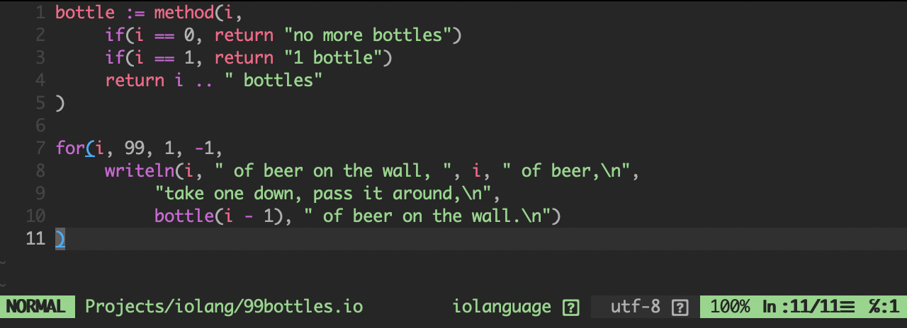

# vim-iolanguage

Plugin for the Vim which adds support of the [Io language](https://iolanguage.org/).



## Features

* Syntax highlighting 
* Navigation between object declarations with `]]` or `[[`
* Running a script from the current buffer with <leader>r

## How to install

First of all you should install Io language:
[Io language installation](https://iolanguage.org/guide/guide.html#Introduction-Installing)

Then you can install this plugin with [vim-plug](https://github.com/junegunn/vim-plug) for example.
Just add to your `.vimrc`:
```
Plug 'vladimir-popov/vim-iolanguage'
```
and then run: `:PlugInstall`
